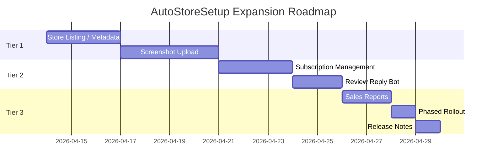

# 🗺️ AutoStoreSetup — Expansion Roadmap

## Phân tích kiến trúc hiện tại

Hệ thống của bạn đã được thiết kế theo pattern rất tốt để mở rộng:

```
Google Sheet (multi-tab)          MainController
  ├── Tab: IAP Data      ──────▶   ├── DataParser (đã có)
  ├── Tab: Store Listing  ─────▶   ├── ListingParser (mới)
  ├── Tab: Screenshots    ─────▶   ├── ScreenshotParser (mới)
  └── Tab: Subscriptions  ─────▶   └── SubscriptionParser (mới)
                                          │
                              ┌───────────┼───────────┐
                              ▼                       ▼
                    GooglePlayClient          AppStoreClient
                    (mở rộng methods)        (mở rộng methods)
```

> **Kết luận: Rất thuận tiện để tích hợp.** Cùng 1 Google Sheet, cùng 1 Service Account, cùng 1 CLI — chỉ thêm tab + thêm parser + thêm method vào client.

---

## Các hướng mở rộng — xếp theo ROI (thời gian tiết kiệm / công sức implement)

### 🏆 Tier 1 — ROI cực cao (nên làm ngay)

#### 1. Store Listing / Metadata (Tên app, mô tả, keywords)

| | Chi tiết |
|---|---|
| **Thời gian tiết kiệm** | 30-60 phút/lần release × 2 platforms |
| **Độ khó implement** | ⭐⭐ Trung bình |
| **API Support** | ✅ Google Play Edits API, ✅ App Store Connect API v1 |
| **Tích hợp** | Thêm tab `Store Listing` trong cùng Google Sheet |

**Google Sheet tab "Store Listing":**

| field | en-US | vi |
|-------|-------|-----|
| app_name | Water Go Puzzle | Water Go - Xếp Hình |
| short_description | Fun puzzle game! | Trò chơi giải đố vui! |
| full_description | ... | ... |
| keywords (iOS only) | puzzle,water,game | xếp hình,nước,game |
| promo_text (iOS) | New levels! | Màn mới! |

**Code cần thêm:**
```python
# Thêm class mới
class StoreListingParser     # đọc tab "Store Listing"
class StoreListingData       # dataclass cho listing

# Mở rộng client hiện có
GooglePlayClient.update_listing(listing)   # Edits API → apklistings
AppStoreClient.update_app_info(listing)    # /v1/appInfos, /v1/appInfoLocalizations
```

**Phù hợp kiến trúc:** ⭐⭐⭐⭐⭐ — Pattern y hệt IAP, chỉ khác data model và API endpoint.

---

#### 2. Screenshot & Preview Upload

| | Chi tiết |
|---|---|
| **Thời gian tiết kiệm** | 1-2 giờ/lần (upload từng ảnh × size × locale) |
| **Độ khó implement** | ⭐⭐⭐ Trung bình-khó |
| **API Support** | ✅ Google Play Edits API (images), ✅ App Store Connect (appScreenshots) |
| **Tích hợp** | Tab "Screenshots" + folder ảnh trên Google Drive hoặc local |

**Google Sheet tab "Screenshots":**

| device_type | locale | display_order | image_url_or_path |
|-------------|--------|---------------|-------------------|
| phone_6.7 | en-US | 1 | https://drive.google.com/... |
| phone_6.7 | en-US | 2 | ./screenshots/en/phone_02.png |
| tablet_12.9 | vi | 1 | https://drive.google.com/... |

**Code cần thêm:**
```python
class ScreenshotParser        # đọc tab + download ảnh từ Drive
class ScreenshotManager       # upload logic

GooglePlayClient.upload_screenshots(device, locale, images)
AppStoreClient.upload_screenshots(device, locale, images)
```

**Phù hợp kiến trúc:** ⭐⭐⭐⭐ — Cần thêm file download logic, nhưng flow chính vẫn giống.

---

### 🥈 Tier 2 — ROI cao (nên làm sau Tier 1)

#### 3. Subscription Management

| | Chi tiết |
|---|---|
| **Thời gian tiết kiệm** | 20-40 phút/subscription plan |
| **Độ khó implement** | ⭐⭐⭐ Trung bình |
| **API Support** | ✅ Google Play Monetization API, ✅ App Store Connect /v1/subscriptions |
| **Tích hợp** | Tab "Subscriptions" trong Google Sheet |

**Google Sheet tab "Subscriptions":**

| product_id | name_en | name_vi | duration | base_price_usd | trial_days | grace_days |
|---|---|---|---|---|---|---|
| com.studio.game.vip_monthly | VIP Monthly | VIP Tháng | P1M | 4.99 | 7 | 3 |
| com.studio.game.vip_yearly | VIP Yearly | VIP Năm | P1Y | 39.99 | 14 | 7 |

**Phù hợp kiến trúc:** ⭐⭐⭐⭐⭐ — Gần giống IAP, chỉ thêm fields (duration, trial, grace period).

---

#### 4. Review Reply Bot

| | Chi tiết |
|---|---|
| **Thời gian tiết kiệm** | 15-30 phút/ngày |
| **Độ khó implement** | ⭐⭐ Dễ-Trung bình |
| **API Support** | ✅ Google Play Reviews API, ✅ App Store Connect /v1/customerReviewResponses |
| **Tích hợp** | Chạy riêng (cron job) hoặc thêm subcommand |

**Ý tưởng:**
```bash
# Pull reviews chưa reply
python main.py reviews --pull

# Auto-reply bằng template (theo rating)
python main.py reviews --auto-reply
```

**Template trong Google Sheet tab "Review Templates":**

| rating | language | template |
|--------|----------|----------|
| 1-2 | en | We're sorry to hear that. Please contact support@... |
| 1-2 | vi | Chúng tôi rất tiếc. Vui lòng liên hệ support@... |
| 4-5 | en | Thank you for your kind words! 🎉 |
| 4-5 | vi | Cảm ơn bạn rất nhiều! 🎉 |

**Phù hợp kiến trúc:** ⭐⭐⭐⭐ — Cần thêm subcommand nhưng reuse toàn bộ auth.

---

### 🥉 Tier 3 — ROI trung bình (nice-to-have)

#### 5. Sales & Download Reports

| | Chi tiết |
|---|---|
| **Thời gian tiết kiệm** | 30 phút/tuần |
| **Độ khó** | ⭐⭐ Dễ |
| **API** | ✅ Google Play Reporting, ✅ App Store Connect Sales Reports |
| **Tích hợp** | Pull data → ghi ngược vào Google Sheet tab "Reports" |

```bash
python main.py reports --period last_week
# → Tự động ghi revenue, downloads vào tab "Reports" trên Sheet
```

**Đặc biệt:** Có thể ghi ngược lên Google Sheet (vì đã có gspread) → team Product xem realtime.

---

#### 6. Phased Rollout Management

| | Chi tiết |
|---|---|
| **Thời gian tiết kiệm** | 10 phút/release |
| **Độ khó** | ⭐ Dễ |
| **API** | ✅ Google Play Edits API (track/releases), ✅ App Store Connect (appStoreVersionPhasedReleases) |

```bash
python main.py rollout --percent 10    # Start 10%
python main.py rollout --percent 50    # Increase to 50%
python main.py rollout --complete      # Full rollout
```

---

#### 7. What's New / Release Notes

| | Chi tiết |
|---|---|
| **Thời gian tiết kiệm** | 15 phút/release |
| **Độ khó** | ⭐ Dễ |
| **API** | ✅ Cả 2 platform |

**Google Sheet tab "Release Notes":**

| version | locale | notes |
|---------|--------|-------|
| 2.5.0 | en-US | - New water levels\n- Bug fixes |
| 2.5.0 | vi | - Tìa thêm màn nước mới\n- Sửa lỗi |

---

## Đề xuất lộ trình implementation



---

## Tổng quan tích hợp với hệ thống hiện tại

| Tính năng | Thêm Google Sheet Tab | Reuse Auth | Reuse DataParser pattern | Thêm Client method | Effort |
|-----------|:---:|:---:|:---:|:---:|:---:|
| Store Listing | ✅ | ✅ | ✅ | ✅ | 1-2 ngày |
| Screenshots | ✅ | ✅ | ✅ (+ download) | ✅ | 2-3 ngày |
| Subscriptions | ✅ | ✅ | ✅ | ✅ | 1-2 ngày |
| Review Reply | ✅ | ✅ | Partial | ✅ | 1 ngày |
| Sales Reports | ✅ (ghi ngược) | ✅ | ❌ (logic mới) | ✅ | 1 ngày |
| Phased Rollout | ❌ | ✅ | ❌ | ✅ | 0.5 ngày |
| Release Notes | ✅ | ✅ | ✅ | ✅ | 0.5 ngày |

> [!TIP]
> **Tất cả 7 features đều reuse cùng 1 Service Account (Google) và 1 Apple API Key.** Không cần setup credential mới. Đây là điểm mạnh nhất của kiến trúc hiện tại.

> [!IMPORTANT]
> **Khuyến nghị:** Bắt đầu từ **Store Listing + Release Notes** — effort thấp nhất nhưng tiết kiệm nhiều thời gian nhất khi release mới. Screenshot upload nên làm sau vì phức tạp hơn (binary upload + device mapping).

---

## Thay đổi kiến trúc cần thiết

Khi mở rộng nhiều features, nên refactor CLI từ single command → **subcommands**:

```bash
# Hiện tại (giữ nguyên)
python main.py                          # IAP sync (default)

# Mở rộng
python main.py iap --dry-run            # IAP sync
python main.py listing --dry-run        # Store listing sync
python main.py screenshots --upload     # Screenshot upload
python main.py subs --dry-run           # Subscription sync
python main.py reviews --pull           # Pull reviews
python main.py reports --period weekly  # Sales reports
python main.py rollout --percent 25     # Phased rollout
```

Thay `@click.command()` → `@click.group()` + `@cli.command()` — thay đổi nhỏ, tương thích ngược.
